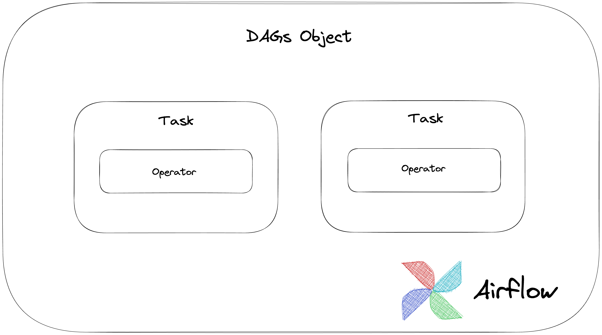

## ทบทวนว่า Data Pipeline คืออะไร

จากหัวข้อ [Data Pipeline](../docs/06-data-pipelines.md) เราได้ทราบกันไปแล้ว ว่า Data Pipeline หรือสายท่อลำเลียงเป็นเครื่องมือที่ใช้ในการลำเลียงข้อมูลจากแหล่งข้อมูล (Data Source) ไปยังจุดหมาย (Destination) เพื่อนำข้อมูลไปเก็บไว้ หรือนำไปสร้างคุณค่าทางธุรกิจ ในหัวข้อนี้เราจะกล่าวถึงเครื่องมือที่ถูกนำมาใช้ในการจัดการ Data Pipeline เพื่อให้เข้าใจหลักการทำงาน และศึกษาต่อยอดได้

## Apache Airflow คืออะไร
คือโอเพ่นซอร์สแพลตฟอร์มประเภท **task orchestrator** ที่ได้รับความนิยมอย่างมาก ซึ่งถูกใช้ในการจัดการสายท่อลำเลียงต่าง ๆ ที่เกิดขึ้นในระบบให้มีความเป็นระเบียบ โดยจัดการวางลำดับคิวของสายท่อลำเลียงให้มีประสิทธิภาพ และเฝ้าสังเกตการทำงานตั้งแต่ต้นจนจบกระแสงานได้

ก่อนที่เราจะสามารถเขียนโค้ดเพื่อกำหนด Workflow ได้เราจำเป็นที่จะต้องมีสกิลโปรแกรมมิ่งก่อน โดยภาษาที่ Airflow รองรับคือภาษาไพธอนที่มีความง่ายในการเริ่มต้นศึกษา และมีสังคมของผู้ใช้งานที่มีขนาดใหญ่มาก โดยมีคนติดดาวบนเว็บไซต์ Github มากกว่า 2 หมื่นผู้ใช้เลยทีเดียว

## Apache Airflow Concept

* [DAG (Directed Acyclic Graph)](#dag)
* [Task](#tasks)
* [Operators](#operators)

### DAG

ย่อมาจาก **Directed Acyclic Graph**  เป็น Data Pipeline ที่ถูกเขียนด้วย Python แต่ละ DAG คือ กลุ่มก้อนของ Tasks ที่ถูกจัดระเบียบเพื่อแสดงความสัมพันธ์ของแต่ละ Tasks บนหน้า UI เรามาดูส่วนประกอบแยกย่อยของแต่ละตัวกัน D-A-G

- **Directed**: การนำงานมาต่อกันแต่ต้องมีอย่างน้อยหนึ่ง **task** ที่เป็นตัวต้นทาง หรือปลายทาง
- **Acyclic**: Airflow ไม่อนุญาตให้สามารถสร้าง data pipeline ที่วนกลับมาที่โหนดต้นทางได้ ไม่งั้นจะเกิดการลูปแบบไม่มีที่สิ้นสุด
- **Graph**: งานทั้งหมดถูกจัดวางในโครงสร้างที่ชัดเจน และถูกเซ็ทความสัมพันธ์ของแต่ละงานไว้

### Tasks

Tasks เป็นโหนดที่อยู่ในแต่ละ DAG แสดงการทำงานแต่ละสเต็ปใน workflow โดยงานที่ Tasks ทำนั้นจะถูกกำหนดไว้ใน Operators

### Operators

Operators คือ Building blocks ของ Airflow ถูกใช้ในการกำหนดงานที่ต้องทำในแต่ละขั้นตอนของกระบวนการ เช่น PythonOperator และ BashOperator เป็นต้น

## Airflow DAG definition file
หลังจากที่เราทราบคอนเส็ปคร่าว ๆ ของ Apache Airflow กันแล้ว ต่อไปเราจะมาฝึกเขียน Data Pipeline กัน แต่เราต้องทราบส่วนประกอบต่าง ๆ ของ DAG file ที่ใช้ในการกำหนดกระแสงานที่เกิดขึ้นในสายท่อลำเลียงข้อมูลของเราก่อน
1. **Importing modules** เป็นการเรียกใช้โมดูล และ Operators ต่าง ๆ ที่จำเป็นต้องใช้

2. **Default Arguments** เป็นค่า Config ที่จะถูกเรียกใช้ในการทำงานทุก Task สามารถเขียนทับได้หากไม่ต้องการใช้ใน Task นั้น ๆ
3. **Instantiate a Dag** เป็นการสร้างก้อน DAG โดยสามารถกำหนด start_date และ end_date รวมไปถึงสามารถตั้งค่าได้ว่าจะรัน DAG นี้บ่อยแค่ไหน
4. **Tasks** เกิดจากการสร้าง Operator ขึ้นมา โดยมี task_id เป็น Unique ID ที่จะระบุถึง task นั้น
5. **Setiing up Dependencies** เป็นการตั้งค่า Dependency ว่า DAG นั้นจะมีกระแสงานแบบไหนบ้าง
